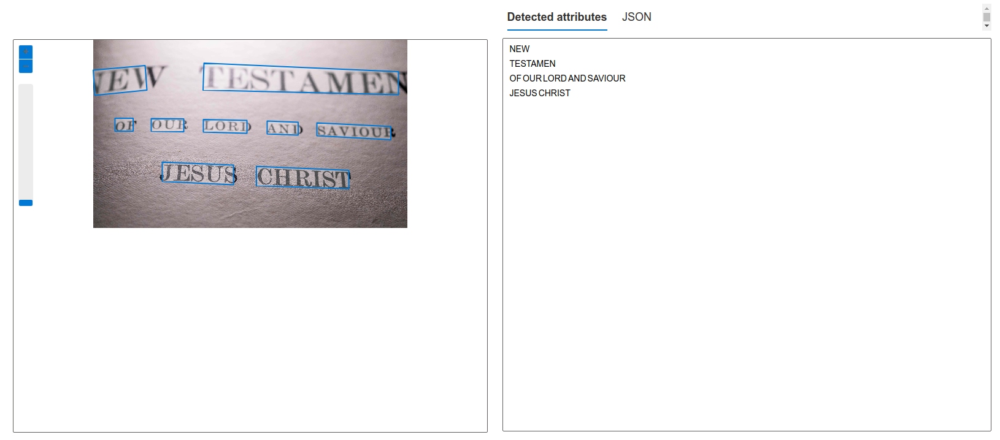
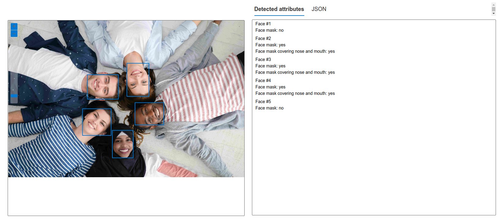
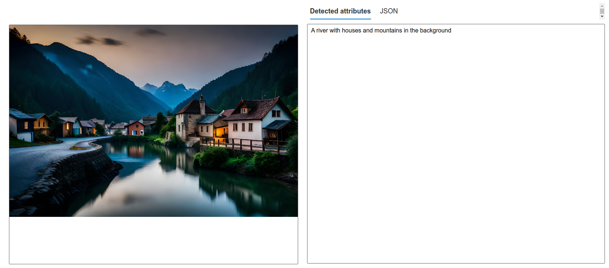

# dio-lab-azure-ai-services
Repositório do desafio DIO - Reconhecimento Facial e transformação de imagens em Dados no Azure ML

Neste projeto nos trabalhamos implementação de um modelo de reconhecimento de imagens utilizando o serviço Azure AI Services do Azure. Onde podemos ver diversas aplicações e possibilidades de uso de inteligência artificial com imagens.

## Passos para realização do desafio

- Utilizando o https://portal.vision.cognitive.azure.com, nos podemos ver diversas possibilidades do uso de inteligência artificial com imagens. Utilizamos 3 serviços do Azure AI Services para realizar o desafio proposto:
    - Optical character recognition (OCR): Reconhecimento de caracteres
    - Face: Reconhecimento facial
    - Image Analysis: Análise de imagens

### 1. Optical character recognition (OCR): Reconhecimento de caracteres

Utilizando o serviço do Azure nos podemos reconhecer caracteres em imagens. E como isso ele nos retorna todos os textos que foram encontrados na imagem e suas posições.

### 2. Face: Reconhecimento facial

Utilizando o serviço do Azure nos podemos reconhecer rostos em imagens. E como isso ele nos retorna todas as informações sobre os rostos que foram encontrados na imagem, quantidade de rostos e posições.

### 3. Image Analysis: Análise de imagens

Utilizando o serviço do Azure nos identificar os componentens que estão presentes na imagem. E como isso ele nos retorna uma descrição da imagem. Esse recurso é muito interessante para pessoas com deficiência visual.

